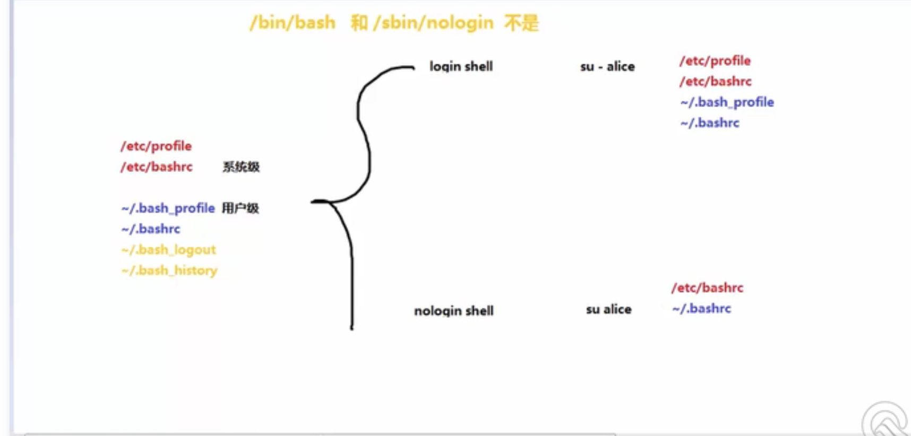

# shell 笔记
1.  自动化批量系统初始化程序 （update 软件安装，时区设置， 安全策略）
2.  自动化软件部署
3.  管理应用程序 （KVM postgresql）
4.  日志分析处理（PV UV 200， top100， grep awk）
5.  自动化备份恢复 （postgresql备份 crond）
6.  自动化管理程序（批量远程修改密码， 软件升级， 配置更新）
7.  自动化信息采集和监控 （收集系统/应用状态信息， CPU，Mem， Disk，Net， TCP，Status， Apache， MySQL）
8.  自动化扩容 （增加云主机 -》部署应用）Zabbix

# 第一天
## 部分常识
1. 每个命令的返回值 在$?变量中
2. 如果上个命令是正确的，那么$?变量值为0，如果失败就是其他数值
## 命令分割赋 Linux 命令行上执行多个命令（分隔符简介&使用）
1.  如果命令被分号(;)所分隔，那么命令会连续的执行下去，就算是错误的命令也会继续执行后面的命令。示例如下：
````shell script

ls /home/;ls /etc/c

````  
2.. 如果命令被 && 所分隔，那么命令也会一直执行下去，但是中间有错误的命令就不会执行后面的命令，没错就继续执行直至命令执行完为止。
  ````shell script
  
  ls /home/ && ls /etc/c
  
  ```` 
3.. 如果命令被双竖线 || 所分隔，那么一遇到可以执行成功的命令就会停止执行后面的命令，而不管后面的命令是否正确。如果执行到错误的命令就是继续执行后一个命令，直到遇到执行到正确的命令或命令执行完为止

  ````shell script
  ./start.sh  || bash record_error_log.sh
  如果start.sh执行错误就执行后面的命令
  ```` 
## 管道 重定向
linux启动后，会默认打开3个文件描述符，分别是：标准输入standard input 0,正确输出standard output 1,错误输出：error output 2

以后打开文件后。新增文件绑定描述符 可以依次增加。 一条shell命令执行，都会继承父进程的文件描述符。因此，所有运行的shell命令，都会有默认3个文件描述符。

这些默认的输出，输入都是linux系统内定的，我们在使用过程中，有时候并不希望执行结果输出到屏幕。我想输出到文件或其它设备。这个时候我们就需要进行输出重定向了。

inux shell下常用输入输出操作符是：

1.  标准输入   (stdin) ：代码为 0 ，使用 < 或 << ； /dev/stdin -> /proc/self/fd/0   0代表：/dev/stdin
2.  标准输出   (stdout)：代码为 1 ，使用 > 或 >> ； /dev/stdout -> /proc/self/fd/1  1代表：/dev/stdout
3.  标准错误输出(stderr)：代码为 2 ，使用 2> 或 2>> ； /dev/stderr -> /proc/self/fd/2 2代表：/dev/stderr


管道命令操作符是：”|”,它仅能处理经由前面一个指令传出的正确输出信息，也就是 standard output 的信息，对于 stdandard
error 信息没有直接处理能力。然后，传递给下一个命令，作为标准的输入 standard input.


管道命令与重定向区别
区别是：

1. 左边的命令应该有标准输出 | 右边的命令应该接受标准输入
   左边的命令应该有标准输出 > 右边只能是文件
   左边的命令应该需要标准输入 < 右边只能是文件
   
2. 管道触发两个子进程执行"|"两边的程序；而重定向是在一个进程内执行
 
   这些都是网上总结很多的，其实只要多加清楚用法，也一定有自己的一份不同描述。

## 执行文件
1.  明确解释器 
    bash xx.sh

2.  不明确解释器
    /绝对路径/xxx.sh
    ./ 相对路径/xxx.sh
    在不明确解释器的情况下 shebang 很重要


## shebang
#！ 声明一下程序用哪个解释器去执行

  ````shell script
    #！ /usr/bin/bash
  ```` 
/ 绝对路径 ./ 相对路径 直接执行文件的时候 不具体使用

## 不同语言的执行
C 编译之后 机器码 CPU 可以直接读 所以最快
JAVA

SHELL 解释 执行的时候才去考虑里面的逻辑
EXPECT
PERL

PYTHON 解释/编译

## EOF
EOF是（END Of File）的缩写，表示自定义终止符。既然自定义，那么EOF就不是固定的，可以随意设置别名，在linux按ctrl-d 就代表EOF。
EOF一般会配合cat能够多行文本输出。

其用法如下：

<<EOF        #开始

....                  #输入内容

EOF            #结束

还可以自定义，比如自定义：

<<ABC        #开始

....

ABC              #结束

通过cat配合重定向能够生成文件并追加操作，在它之前先熟悉几个特殊符号

<：输入重定向

>：输出重定向

>>：输出重定向,进行追加,不会覆盖之前内容

<<：标准输入来自命令行的一对分隔号的中间内容

````shell script

[root@ren5 ~]# cat <<-EOF

> hello

> EOF

hello

````

# 第二天

## SHELL 特性

### shell 命令cp ls date
    linux支持的shell
    
    cat /etc/shells 
        # List of acceptable shells for chpass(1).
        # Ftpd will not allow users to connect who are not using
        # one of these shells.
        
        /bin/bash
        /bin/csh
        /bin/dash
        /bin/ksh
        /bin/sh
        /bin/tcsh
        /bin/zsh

### shell的 开机执行顺序


su命令和su -命令最大的本质区别就是：
前者只是切换了root身份，但Shell环境仍然是普通用户的Shell；
而后者连用户和Shell环境一起切换成root身份了。
只有切换了Shell环境才不会出现PATH环境变量错误。
su切换成root用户以后，pwd一下，发现工作目录仍然是普通用户的工作目录；而用su -命令切换以后，工作目录变成root的工作目录了。用echo $PATH命令看一下su和su -以后的环境变量有何不同。以此类推，要从当前用户切换到其它用户也一样，应该使用su -命令

### GUN/SHELL特点
1.  命令和文件会自动补齐
2.  命令历史记忆功能 上下键，
    ！数字 ，  !100 执行历史命令，
    ！字符     执行上一个最近的字符开头的命令
    ！$       上一个命令最后的参数
    ！！      上一个命令
    ctrl + R  搜索命令
3.  alias 查看当前shell的别名
4.  相加别名 修改.bashrc文件
5.  避开使用别名 \命令  这样就可以直接使用命令本身
6.  CTRL + 
            D 退出shell
            A 光标移动到命令最前
            E 光标移到最后
            U 清除光标左边的内容
            K 清除光标右边的内容
            L 清屏
            S 锁屏
            Q 恢复屏幕
            Y 撤销
7. 前台后台操作
            & 将进程放到后台去执行
            nohup 使用nohup开启后台进程，并且将输入结果写到nohup.out里面
            CTRL + Z 将前台进程放到后台去
            bg
            fg 将后台进程拿到前台来 （编辑文件的时候 还要干其他事情的时候可以用）
            kill %3 当前shell的后来进程序列号
8. 输入输出重定向
    1. 0，1，2 > >> 
        *   0 输入 默认键盘
        *   1 输出默认 屏幕
        *   2  错误信息
            <table>
                <caption>表2：Bash 支持的输出重定向符号</caption>
                <tbody>
                    <tr>
                        <th width="140">
                            类&nbsp;型
                        </th>
                        <th width="210">
                            符&nbsp;号
                        </th>
                        <th>
                        作&nbsp;用</th>
                    </tr>
                    <tr>
                        <td rowspan="2">
                        标准输出重定向</td>
                        <td>
                        command&nbsp;&gt;file</td>
                        <td>
                        以覆盖的方式，把 command 的正确输出结果输出到 file&nbsp;文件中。</td>
                    </tr>
                    <tr>
                        <td>
                        command &gt;&gt;file</td>
                        <td>
                        以追加的方式，把 command 的正确输出结果输出到 file&nbsp;文件中。</td>
                    </tr>
                    <tr>
                        <td rowspan="2">
                        标准错误输出重定向</td>
                        <td>
                        command 2&gt;file</td>
                        <td>
                        以覆盖的方式，把 command 的错误信息输出到 file&nbsp;文件中。</td>
                    </tr>
                    <tr>
                        <td>
                        command 2&gt;&gt;file</td>
                        <td>
                        以追加的方式，把 command&nbsp;的错误信息输出到 file&nbsp;文件中。</td>
                    </tr>
                    <tr>
                    <td colspan="1" rowspan="6">
                    正确输出和错误信息同时保存</td>
                    <td>
                    command &gt;file&nbsp;2&gt;&amp;1</td>
                    <td>
                    以覆盖的方式，把正确输出和错误信息同时保存到同一个文件（file）中。</td>
                    </tr>
                    <tr>
                    <td>
                    command &gt;&gt;file&nbsp;2&gt;&amp;1</td>
                    <td>
                    以追加的方式，把正确输出和错误信息同时保存到同一个文件（file）中。</td>
                    </tr>
                    <tr>
                    <td>
                    command &gt;file1 2&gt;file2</td>
                    <td>
                    以覆盖的方式，把正确的输出结果输出到 file1 文件中，把错误信息输出到 file2 文件中。</td>
                    </tr>
                    <tr>
                    <td>
                    command &gt;&gt;file1&nbsp; 2&gt;&gt;file2</td>
                    <td>
                    以追加的方式，把正确的输出结果输出到 file1 文件中，把错误信息输出到 file2 文件中。</td>
                    </tr>
                    <tr>
                    <td>
                    command &gt;file 2&gt;file</td>
                    <td colspan="1" rowspan="2">
                    【<span style="color:#b22222;"><b>不推荐</b></span>】这两种写法会导致 file 被打开两次，引起资源竞争，所以 stdout 和 stderr 会互相覆盖，我们将在《<a href="/view/vip_3241.html" target="_blank">结合Linux文件描述符谈重定向，彻底理解重定向的本质</a>》一节中深入剖析。</td>
                    </tr>
                    <tr>
                    <td>
                    command &gt;&gt;file 2&gt;&gt;file</td>
                    </tr>
                </tbody>
             </table>
            <br />
            在输出重定向中，<code>&gt;</code>代表的是覆盖，<code>&gt;&gt;</code>代表的是追加。

    2.  < 输入重定向
         
         /usr/bin/cat < /etc/host
         
         cat > file1 <<-EOF
         EOF
9.  管道 | 上一个命令输出作为下一个命令的输入

10. 命令排序
    *  ; 不具备逻辑判断
    *  && 具备逻辑判断 前一个命令成功
    *  前一个命令不成功 后一个命令才执行
    
11. 通配符
    +   11.1 * 匹配多个字符
    +   11.2 ？匹配任意字符
    +   11.3 [] 匹配括号中任意一个字符[abc] [0-9] [a-zA-Z0-9]  [a-zA-Z0-9]
    +   11.4 () 在子shell中执行不会影响当前shell (unmask 077;touch test.txt)
    +   11.5 {} 集合 touch file{1..9}
        *   mkdir /home/{111,222}